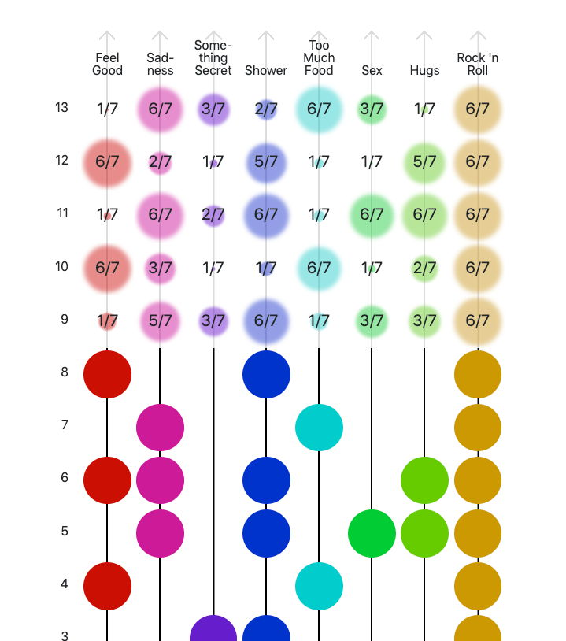

# sensibus

A time series logger, analyser, and predictor for your daily feelings and activity. Provides future prediction via dynamic naive bayesian methods.

## Install

    $ git clone https://github.com/axelpale/sensibus.git
    $ cd sensibus
    $ npm install
    $ npm run build
    $ npm start

Then, open [localhost:8888](http://localhost:8888/) in your web browser.

## Licence

[GPL 3.0](LICENSE)
